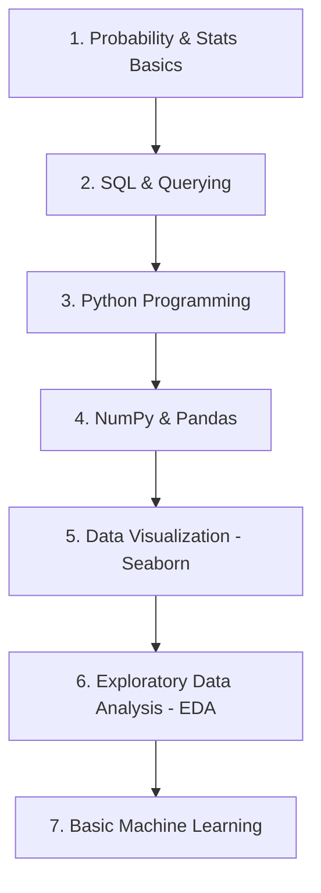

# 📊 Data Analytics Reference Repository

[](https://opensource.org/licenses/MIT)
[](https://www.python.org/)
[](https://github.com/your-username/data-analytics/issues)

Welcome to the **Data Analytics** repository! This is a curated, structured hub of learning resources, guides, PDF books, cheat sheets, and code implementations designed to build a strong foundation in data science, statistics, and analytics libraries.

---

## 🗺️ Repository Map & Roadmap

Below is the planned structure of this repository. Use this map to navigate through the topics:

```text
data-analytics/
│
├── 📂 probability-statistics/     # Probability theory, statistical distributions, hypothesis testing
│   ├── 📄 probability_cheat_sheet.pdf
│   ├── 📄 statistical_inference_guide.pdf
│   └── 📓 distribution_visualizations.ipynb
│
├── 📂 python-libraries/          # Python data stack tutorials and code snippets
│   ├── 📂 numpy/
│   ├── 📂 pandas/
│   ├── 📂 matplotlib-seaborn/
│   └── 📂 scikit-learn/
│
├── 📂 sql-databases/             # SQL queries, optimization, schemas, and analytical functions
│   ├── 📄 sql_cheat_sheet.pdf
│   └── 📂 case-studies/
│
├── 📂 data-cleaning/             # Preprocessing techniques, missing values, outliers
│   └── 📓 data_preprocessing_template.ipynb
│
├── 📂 datasets/                  # Practice datasets (CSV, JSON, SQL)
│   └── 📄 sample_sales_data.csv
│
└── 📄 README.md                  # You are here!
```

---

## 📚 Core Topics Covered

### 1. 🎲 Probability & Statistics
A deep dive into the mathematical backbone of data analytics. 

| Topic | Key Concepts | Reference PDFs / Notebooks |
| :--- | :--- | :--- |
| **Descriptive Statistics** | Mean, Median, Mode, Variance, Standard Deviation, Skewness, Kurtosis | `[Uploaded Sucessfully]` |
| **Probability Theory** | Bayes' Theorem, Conditional Probability, Permutations & Combinations | `[Uploaded Sucessfully]` |
| **Distributions** | Normal (Gaussian), Binomial, Poisson, Exponential, t-Distribution | `[Uploaded Sucessfully]` |
| **Inferential Statistics** | Central Limit Theorem, Confidence Intervals, Hypothesis Testing ($z$-test, $t$-test, ANOVA, Chi-Square) | `[Uploaded Sucessfully]` |

---

### 2. 🐍 Python Libraries for Data Science
Hands-on guides and cheat sheets for the core Python libraries used in modern data workflows.

*   **[NumPy](https://numpy.org/)**: Multidimensional arrays, linear algebra, vectorization, and mathematical operations.
*   **[Pandas](https://pandas.pydata.org/)**: DataFrames, Series, reading/writing files, indexing, filtering, merging, grouping, and handling time series.
*   **[Matplotlib](https://matplotlib.org/) & [Seaborn](https://seaborn.pydata.org/)**: Static, interactive, and aesthetic data visualizations (histograms, scatter plots, heatmaps, box plots).
*   **[SciPy](https://scipy.org/)**: Scientific computing and advanced statistical functions.
*   **[Scikit-Learn](https://scikit-learn.org/)**: Basic Machine Learning algorithms, feature scaling, train-test splits, and evaluation metrics.

---

### 3. 💾 SQL & Data Querying
Key relational database concepts for extracting business insights.
*   **Basic Queries**: `SELECT`, `WHERE`, `GROUP BY`, `HAVING`, `ORDER BY`
*   **Joins**: `INNER JOIN`, `LEFT/RIGHT JOIN`, `FULL OUTER JOIN`, self joins
*   **Subqueries & CTEs**: Common Table Expressions for readable queries
*   **Window Functions**: `ROW_NUMBER()`, `RANK()`, `LEAD()`, `LAG()`, partition by structures

---

## 🚀 Getting Started

To explore the code notebooks and practices locally, follow these steps:

### Prerequisites
Make sure you have **Python 3.8+** installed on your system.

### Installation & Setup

1. **Clone the repository:**
   ```bash
   git clone https://github.com/your-username/data-analytics.git
   cd data-analytics
   ```

2. **Create a virtual environment (Recommended):**
   ```bash
   python -m venv venv
   # On Windows:
   venv\Scripts\activate
   # On macOS/Linux:
   source venv/bin/activate
   ```

3. **Install the dependencies:**
   *(Note: A `requirements.txt` file will be provided as libraries are added).*
   ```bash
   pip install -r requirements.txt
   ```

---

## 📈 Learning Path Recommendation

If you are starting your Data Analytics journey, here is the suggested route to follow:



---

## 🤝 Contributing

Contributions are what make the open-source community such an amazing place to learn, inspire, and create. Any contributions you make are **greatly appreciated**.

1. Fork the Project
2. Create your Feature Branch (`git checkout -b feature/AmazingFeature`)
3. Commit your Changes (`git commit -m 'Add some AmazingFeature'`)
4. Push to the Branch (`git push origin feature/AmazingFeature`)
5. Open a Pull Request

---

## 📄 License

Distributed under the MIT License. See `LICENSE` for more information.
